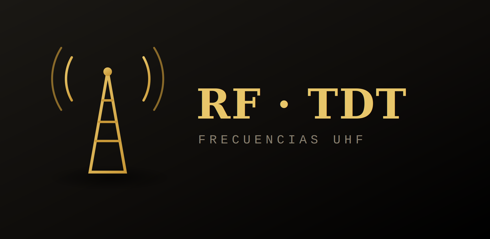

<div align="center">



# RF · TDT España — Frecuencias UHF

**Consulta qué frecuencias UHF ocupa la TDT en cada zona de España para tu microfonía inalámbrica.**

Herramienta visual para técnicos de microfonía inalámbrica y sistemas RF en producciones en directo. Muestra los canales UHF ocupados por la TDT en cada demarcación, con mapa interactivo, visualización del espectro libre y ocupado, verificador de conflictos y calculadora de intermodulación. Funciona sin conexión.

[](https://javitatay.github.io/RFTDT/)

    [](LICENSE)

</div>

---

## ¿Qué es RF · TDT España?

Cuando trabajas con microfonía inalámbrica en un evento o producción en directo, es imprescindible conocer qué frecuencias UHF están ocupadas por la TDT en la zona para evitar interferencias. Esta herramienta centraliza esa información y permite consultarla de forma visual e intuitiva: selección por mapa, filtros en cascada y verificación de conflictos en tiempo real.

No necesita servidor, instalación ni cuenta. Funciona directamente en el navegador cuando se sirve desde un servidor HTTP (GitHub Pages o servidor local).

### Funciones principales

- 📍 **Geolocalización automática** — detecta la ubicación del dispositivo y preselecciona la Comunidad Autónoma y la provincia.
- 📺 **Vista de canales activos** — grid visual con número de canal, frecuencia central y rango ocupado para la demarcación seleccionada; los conflictos con el micrófono se marcan en rojo al instante.
- 📊 **Mapa de espectro** — representación gráfica del espectro UHF 470–694 MHz que muestra en **rojo** los canales TDT ocupados y en **verde** los libres, con tooltip de detalle al pasar el cursor.
- 🗺️ **Mapa interactivo con zoom gradual** — selección en 4 pasos (CA → Provincia → Demarcación → Ámbito) con zoom automático (`flyToBounds`) a la zona; al limpiar la selección vuelve a la vista general de España.
- 📌 **Markers de demarcación** — al seleccionar una provincia aparecen marcadores circulares orientativos por demarcación; el seleccionado se rellena en verde y un clic sobre él selecciona la demarcación directamente. Las coordenadas son aproximadas y se irán refinando con datos reales de repetidores.
- 🧭 **Panel lateral contextual** — muestra las provincias como chips al elegir CA, el número de ámbitos por demarcación al elegir provincia y los canales ocupados al completar la selección.
- 🔎 **Filtros en cascada** — filtra por CA → Provincia → Demarcación → Ámbito de cobertura, sincronizados con el mapa.
- ⚠️ **Verificador de frecuencia** — introduce la frecuencia central de tu micrófono y comprueba si entra en conflicto con algún canal TDT activo en la demarcación.
- 📤 **Exportar CSV** — exporta el espectro UHF en formato de scan compatible con **Shure Wireless Workbench** y **SoundBase Coord** (dos columnas `frecuencia,dBm`, paso 25 kHz, canales ocupados a −20 dBm).
- 📤 **Exportar WWB .shw** — genera un proyecto nativo de **Shure Wireless Workbench** con los canales TDT de la demarcación seleccionada ya marcados como excluidos (`<exclude>true</exclude>`), listo para abrir directamente en WWB sin configuración adicional.
- 🔃 **Tabla ordenable** — ordena los resultados por cualquier columna (canal, frecuencia, rango, demarcación…).
- 🧮 **Calculadora de intermodulación IM3** — comprueba si las frecuencias de tu sistema generan productos de intermodulación de tercer orden, con diagrama explicativo interactivo integrado.

---

## 🌐 Usar sin instalar nada

La herramienta está disponible en línea y no requiere instalación:

👉 **[javitatay.github.io/RFTDT](https://javitatay.github.io/RFTDT/)**

Funciona igual en móvil y en ordenador. Desde el navegador del móvil puedes usar la opción **"Añadir a la pantalla de inicio"** para tenerla siempre a mano.

---

## 🧮 Calculadora de intermodulación IM3

La página `intermodulacion.html` combina la calculadora con un **diagrama explicativo interactivo**, pensado para técnicos que necesitan entender o enseñar el fenómeno en campo.

### Diagrama explicativo

- **3 pasos conceptuales** — explica de forma progresiva qué ocurre: dos transmisores activos generan señales fantasma (productos IM3) que pueden coincidir con otras frecuencias del sistema.
- **Simulador interactivo** — dos sliders permiten mover Fa y Fb libremente por la banda UHF (470–690 MHz) en pasos de **25 kHz**, observando en tiempo real los productos IM₁/IM₂, la separación Δ, la visualización en canvas y la alerta de conflicto.

### Calculadora

Introduciendo las frecuencias reales del sistema (hasta 30 dispositivos), calcula todos los productos IM3 por par y muestra el resumen de conflictos con fórmula exacta, visualización de espectro y tabla cruzada completa.

---

## 📤 Integración con Shure Wireless Workbench

RF · TDT España ofrece dos modos de exportación para WWB, accesibles desde el botón de exportar una vez seleccionada una demarcación:

### Exportar CSV (scan de espectro)
Genera un archivo `frecuencia,dBm` con paso de 25 kHz cubriendo 470–694 MHz. Los canales TDT ocupados aparecen a −20 dBm y el espectro libre a −100 dBm. Se importa desde `Frequency coordination → Scan data → Import`.

### Exportar WWB .shw *(nuevo en v3.6.0)*
Genera un proyecto `.shw` nativo de Wireless Workbench con los canales TDT de la demarcación seleccionada marcados directamente como excluidos en la sección `TV Channels`. Al abrir el archivo en WWB los canales bloqueados aparecen de inmediato, sin necesidad de ajustar umbrales ni configuración manual. Compatible con WWB 6 / WWB 7.

---

## 📡 Datos técnicos

| Campo | Valor |
|---|---|
| **Estándar** | DVB-T (TDT) |
| **Banda** | UHF Banda IV / V |
| **Rango** | 470 – 694 MHz |
| **Canales** | CH21 – CH48 (28 canales de 8 MHz) |
| **Rango ocupado por canal** | Frecuencia central ± 4 MHz |
| **Paso de frecuencia (microfonía)** | 25 kHz (0.025 MHz) |
| **Tolerancia detección conflicto IM** | ± 25 kHz |
| **Cobertura geográfica** | España peninsular, Baleares, Canarias, Ceuta y Melilla |
| **Fuente de datos** | CNAF / Ministerio para la Transformación Digital y de la Función Pública |
| **Actualización de datos** | Abril 2026 |
| **Demarcaciones con marker en mapa** | 274 (coordenadas orientativas, pendiente refinamiento) |

---

## 🔄 Actualizar la base de datos

Sustituye `tdt.csv` por una versión actualizada manteniendo el mismo formato de columnas:

```
Comunidad Autónoma, Provincia, Demarcación, Ámbito de Cobertura, Canal, Frecuencia (MHz)
```

Los campos Canal y Frecuencia admiten múltiples valores separados por comas (entre comillas si el campo contiene comas). El HTML parsea y expande automáticamente cada fila en entradas individuales por canal.

---

## ⚠️ Aviso

> **Base de datos actualizada a abril de 2026.** Los datos de canales TDT proceden del CNAF / Ministerio para la Transformación Digital y de la Función Pública. La asignación de frecuencias puede variar: se recomienda verificar con la fuente oficial antes de cada producción y realizar siempre un escaneo RF del espacio de trabajo.

---

## 🛠️ Para desarrolladores

RF · TDT España es una aplicación web autocontenida en HTML, CSS y JavaScript, sin dependencias de framework ni build step. Se sirve como sitio estático mediante GitHub Pages.

```
index.html            · interfaz principal (diseño + lógica)
intermodulacion.html  · calculadora de intermodulación IM3 + diagrama explicativo
tdt.csv               · base de datos de frecuencias por demarcación
.nojekyll             · desactiva Jekyll en GitHub Pages
README.md
```

Para uso local, clona el repositorio y sirve los archivos con cualquier servidor estático:

```bash
git clone https://github.com/javitatay/RFTDT.git
cd RFTDT
npx serve .
# o alternativamente:
python3 -m http.server 8000
```

> **Nota:** abrir `index.html` directamente con doble clic bloquea la carga del CSV por restricciones CORS del navegador. Es necesario usar un servidor local o GitHub Pages.

---

## 🧪 Beta testers

Gracias a los técnicos que han probado la herramienta en condiciones reales y han aportado feedback:

| Técnico | Perfil |
|---|---|
| [@miwel.rar](https://www.instagram.com/miwel.rar?igsh=aG53M3dja2Y1NWlk) | Instagram |

---

## 📄 Licencia

RF · TDT España se distribuye bajo la licencia **[GNU General Public License v3.0](LICENSE)**.

Eres libre de usar, estudiar, modificar y compartir este software. La única condición importante es que, si distribuyes una versión modificada, debe mantenerse también como código abierto bajo esta misma licencia, para que las mejoras sigan estando disponibles para todos.

[](LICENSE)

---

## ✉️ Contacto

**Javier Tatay Rubio**
📧 j.tatayrubio@edu.gva.es

---

<div align="center">
<sub>Herramienta para técnicos audiovisuales · RF · TDT España · 2026</sub>
</div>
